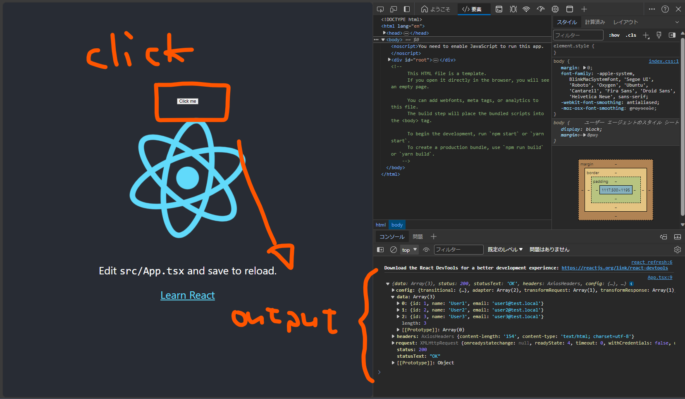

# typescript api test

## introduction

### env for execute

- Windows (no WSL2)
- Powershell

## how to use

### 1. `npm install` into any children dirs

サーバ側 / for server-side

```pwsh
cd server
npm install
```

クライアント側 / for client-side

```pwsh
cd client
npm install
```

### 2. exec both

サーバ側 / for server-side

```pwsh
cd server
npx nodemon
```

クライアント側 / for client-side

```pwsh
cd client
npm run start
```

### 3. access by browser

1. `http://localhost:3000` にアクセスします
2. `click me` のボタンを押します
3. `console.log` として、サーバから取得したデータが表示されます


